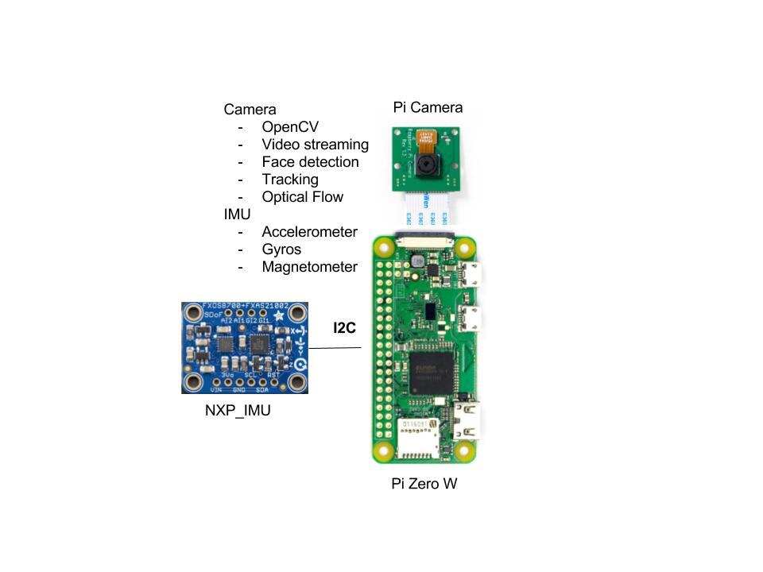

# Heimdall

Heimdall is named after the Norse god who has the ability to see and hear everything.

This is a small monitoring device. Ultimately I would like it to do:

- monitor a room with the camera
- monitor wifi and log devices/APs found
- monitor bluetooth and log devices found

## BOM

| Name | Cost | Source |
|---|---|---|
| Pi Zero W | $10 | https://www.adafruit.com/product/3400 |
| NXP IMU   | $14 | https://www.adafruit.com/product/3463 |

# Setup

## Apt-Get

    sudo apt-get update
    sudo apt-get upgrade
    sudo apt-get -y intall python-dev python3-dev build-essential swig cmake
    sudo apt-get -y install libatlas-base-dev gfortran

## Python

    pip install -U pip setuptools wheel
    pip install -U -r requirements.txt
